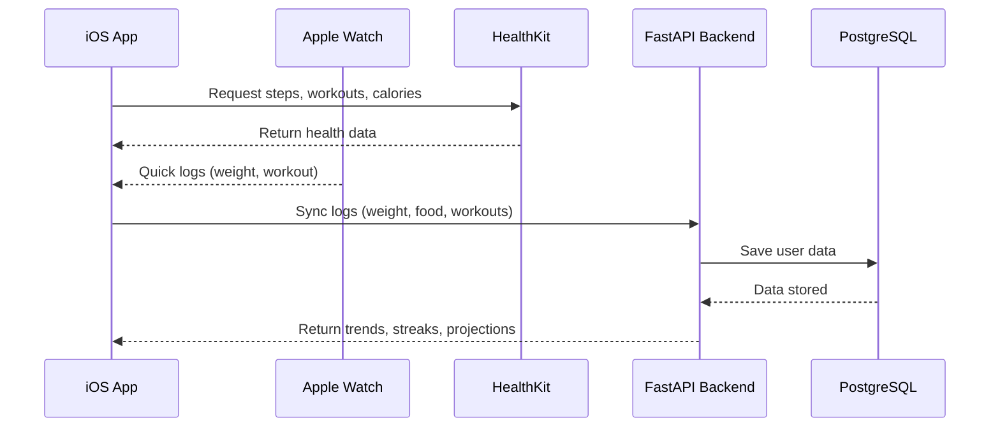

# 🏛️ Architecture – The Journey App

## High-Level Overview

The Journey is designed as a **scalable iOS-first app** with a cloud backend.

### Frontend (iOS)
- **SwiftUI** – declarative UI
- **Combine** – state management
- **HealthKit** – workouts, calories, steps
- **WatchKit** – Apple Watch companion
- **WidgetKit & Swift Charts** – insights + widgets
- **Firebase Auth** – authentication

### Backend (FastAPI + PostgreSQL)
- **FastAPI** – REST API
- **SQLAlchemy ORM** – database access
- **PostgreSQL** – structured storage
- **Redis** (future) – caching for streaks/projections
- **Firebase Auth** – shared authentication
- **Docker & Compose** – containerized services

---

## Data Flow

---

## Modules

### Frontend Modules
- Dashboard (calories, weight, streaks)
- Food Log (custom foods, macros)
- Workout Log (HealthKit/manual)
- Watch Extension (quick log, streak view)
- Notifications & Widgets

### Backend Modules
- **Auth** (Firebase integration)
- **User Management**
- **Weight Logs**
- **Food Database**
- **Workout Logs**
- **Deficit Engine** (streaks & projections)
- **Notifications** (server-side logic future)
